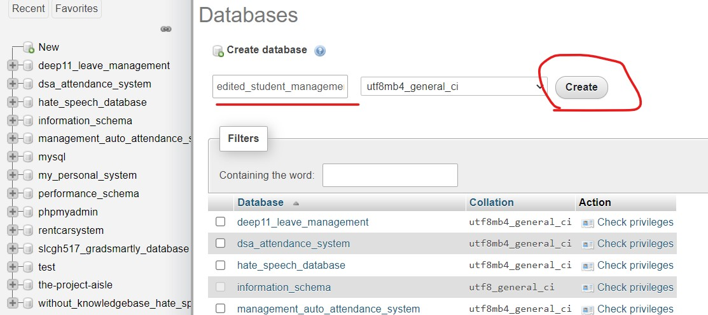
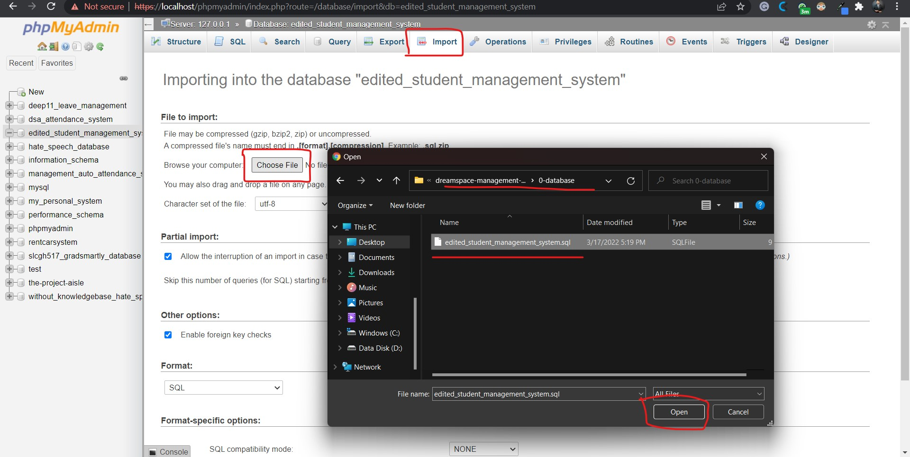
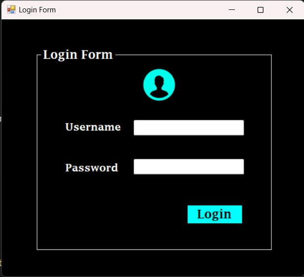
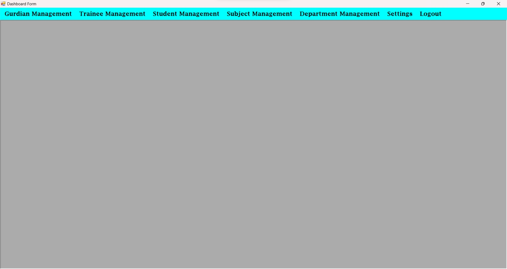
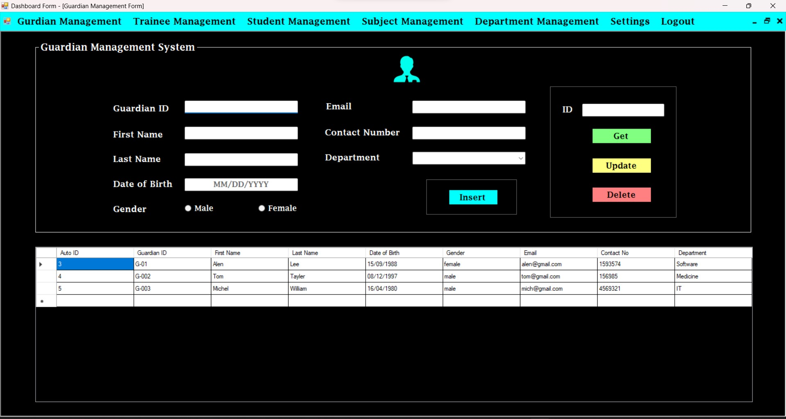
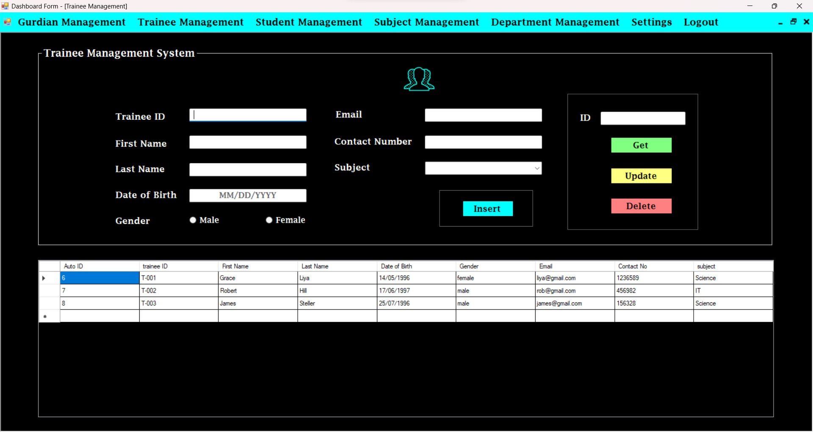
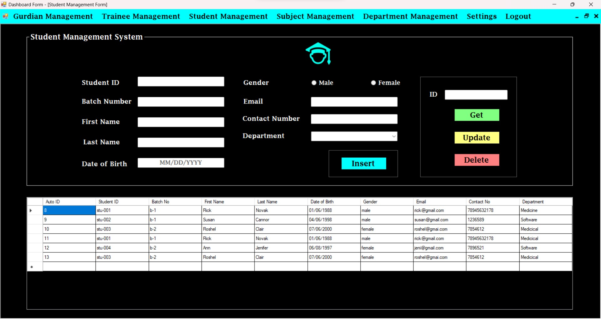
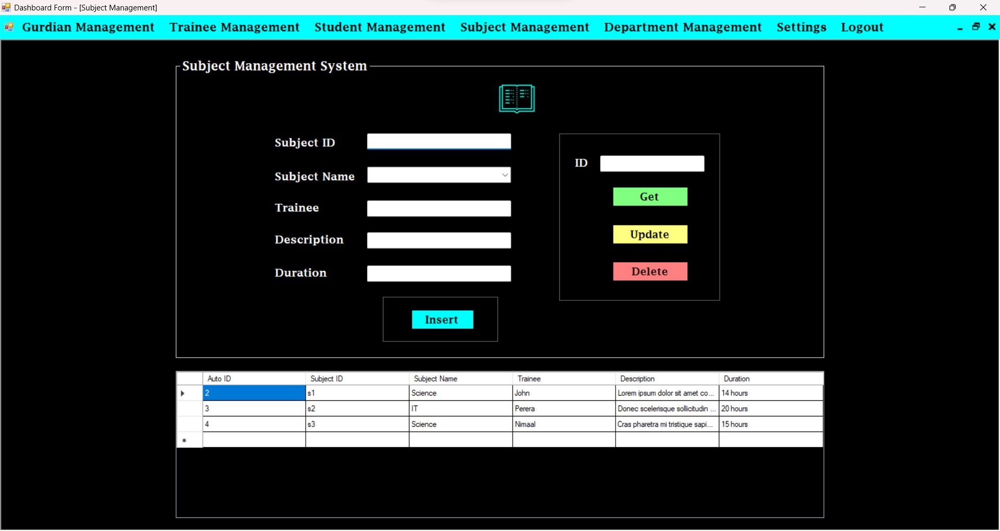
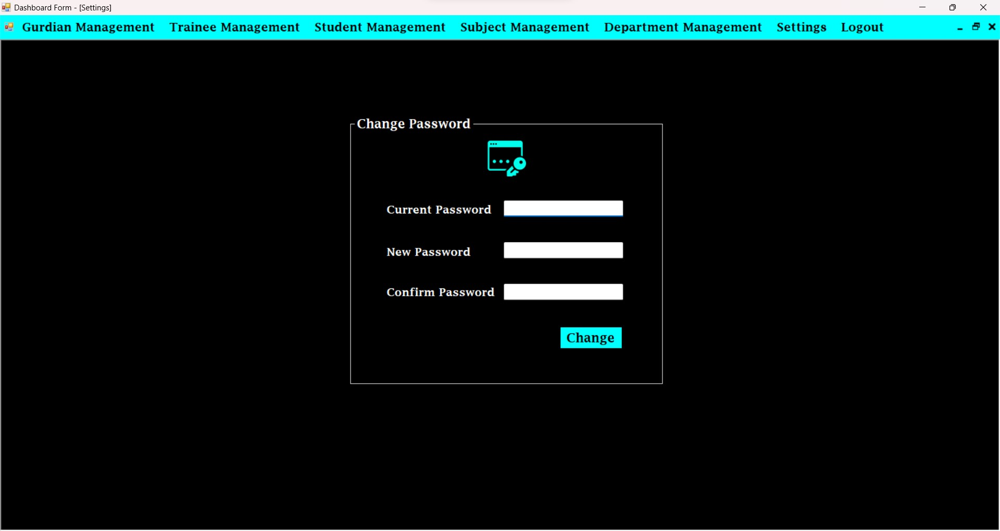

# DreamSpace Management System

## Introduction

A management system for DreamSpace's operations works. DreamSpace is a learning center in Sri Lanka, Batticaloa. This system was developed to support the operations of DreamSpace Academy.

It is developed for the education purpose to teach students in the real-world application building process, therefore this application contains basic functions of C#.

## Technologies

- C#
- .NET Framework 4.8
- MySQL Database

## Configuration and Setup

### Setup Database

- The database is found on the "0-database" folder of this repository.

```
dreamspace-management-system\github-readme-content
```  


**Step 1:**
-  Create an empty database with the name of "edited_student_management_system" in the MySQL panel.





**Step 2:**
-  Import the database into the created empty database.




## Project Explained

### Login window




- **Username:** dsa
- **Password:** 222

This is the login screen of this system. It has only one admin account.


#### Features
- Login process
- Wrong password & Username message


### Dashboard window



#### Dashboard Structure

- Guardian Management
- Trainee Management
- Student Management
- Subject Management
- Department Management
- Settings
- Logout

#### Guardian Management



**Note:** This module is used to maintain details of guardians.

#### Features
- Display Guardian Details
- Search Guardian Details
- Insert Guardian Details
- Update Guardian Details
- Delete Guardian Details


#### Trainee Management



**Note:** This module is used to maintain details of trainees.

#### Features
- Display Trainees Details
- Search Trainees Details
- Insert Trainees Details
- Update Trainees Details
- Delete Trainees Details


#### Student Management



**Note:** This module is used to maintain details of students.

#### Features
- Display Students Details
- Search Students Details
- Insert Students Details
- Update Students Details
- Delete Students Details


#### Subject Management



**Note:** This module is used to maintain details of subjects.

#### Features
- Display Subjects Details
- Search Subjects Details
- Insert Subjects Details
- Update Subjects Details
- Delete Subjects Details


#### Department Management


**Note:** This module is used to maintain details of department.

#### Features
- Display Departments Details
- Search Departments Details
- Insert Departments Details
- Update Departments Details
- Delete Departments Details

#### Settings




#### Features
- Change Password

## Execution & Running

**NOTE:** To run the system in Visual Studio debug mode, open the project in Visual Studio.

- Open the following file.

```
dreamspace-management-system\1-project-folder\edited_student_management_system.sln
```

**NOTE:** OR, to run the system using complied exe, open the exe file that is found the debug folder.

```
dreamspace-management-system\1-project-folder\edited_student_management_system\bin\Debug\edited_student_management_system.exe
```


Social Media Links
---

* [Linkedin Profile](https://www.linkedin.com/in/gunarakulangunaretnam/)
* [Facebook Page](https://www.facebook.com/gunarakulangunaretnam)
* [Twitter Profile](https://twitter.com/gunarakulan)
* [Instagram Profile](https://www.instagram.com/gunarakulangunaretnam/)
* [Youtube Channel](https://www.youtube.com/channel/UCMWkED5sabgVZSCKjZuRJXA)
